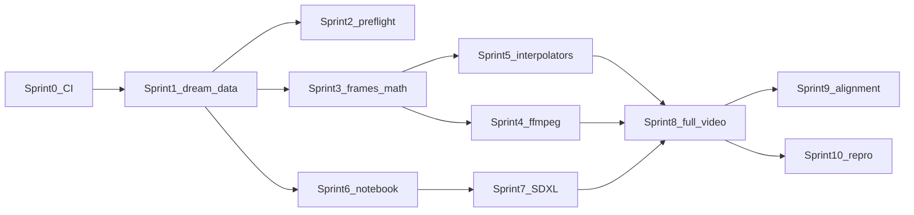

# Dream Pipeline — Sprint & Task Breakdown

This document decomposes the **Poetry as Multimodal Dream** video MVP (SDXL img2img → RIFE → FFmpeg) and adjacent foundation work into **sprints** (each ending in a **demoable, runnable** increment) and **atomic tickets** (each **one commit**, with **pytest** or an explicit **non-test validation**).

**Conventions**

- **Ticket ID:** `S{n}-T{m}` (Sprint n, Task m). Sub-tickets use letter suffixes (e.g. `S6-T1a`) when splitting a former single ticket.
- **Commit:** one logical change; message references ticket ID in the body.
- **Test:** `pytest` under `code/tests/` unless noted; default CI: `pytest -q -m "not ffmpeg and not gpu and not network"`.
- **Validation (non-pytest):** scripted check, golden JSON diff, or documented manual checklist with pass/fail criteria.

**Baseline repo:** `code/llm_analysis.py`, `code/clip_pipeline.py`, `code/fetch_raw_gutenberg.py`, `code/explore_corpus.py`, `code/evaluate_retrieval.py`, `brainstorm/dream-pipeline-v1.md`.

**Peer review:** An internal technical review suggested security/licensing/CI hardening, early alignment work, realistic notebook atomicity, and GPU non-determinism caveats. Those items are merged below as additional tickets and sections.

---

## One-commit policy vs notebooks

- **Python modules / CLI / tests:** Aim for **strict** one-ticket-one-commit.
- **Jupyter notebooks:** Cells often need iterative clearing of outputs and Colab-only verification. Treat **each notebook file save with cleared outputs** as one commit where possible; splitting **S6-T1** into `S6-T1a`–`S6-T1c` is the intended compromise.
- **GPU + SDXL:** `S7-T2` may bisect into factory vs memory flags if OOM debugging demands it—document as follow-up commits referencing the same ticket ID with suffix in message (`S7-T2-mem`).

---

## Security, licensing, and operations (cross-cutting)

These do not replace feature sprints; they attach to the tickets noted.

| Theme | Action | Attach to |
|--------|--------|-----------|
| **Secrets** | Never commit `HF_TOKEN`, OpenRouter keys, or Drive tokens; use Colab secrets UI or env vars; add `nbstripout` / policy doc | S0-T6, S6-T1c |
| **Subprocess** | `subprocess.run([...], shell=False, timeout=..., capture_output=True)` for `ffmpeg` / `ffprobe` | S4-T1, S4-T4 |
| **HF auth** | Document `HF_TOKEN`, `HF_HOME`, gated SDXL weights; login cell pattern without printing token | S7-T0 |
| **Licenses** | README or `NOTICE`: Gutenberg / image dataset / SDXL & Diffusers terms; generated media disclaimer | S0-T6 (docs commit) or new `S-Legal-T1` |
| **Disk / cleanup** | Optional `--jpeg-preview`, delete `frames/` after MP4, max frame cap per poem | S8-T5 (extends resume/cleanup) |
| **Idempotency** | Write outputs to `*.tmp` then rename; `--force` to overwrite; resume from last completed stanza | S8-T5 |
| **Non-determinism** | CUDA/cuDNN/TF32/flash-attn can break byte-identical runs; demos use **mock CPU path** for hash equality; GPU runs log metadata + optional perceptual hash | S10-T0, S10-T4 |
| **Supply chain** | Pin `diffusers` / `torch` min versions in requirements; Colab cells may pin with `==` for demos | S7-T1 |

---

## Sprint 0 — Test harness & CI skeleton

**Sprint goal:** Every later ticket can attach automated checks. Demo: `pytest` passes in a clean venv; optional GitHub Actions runs the same.

| ID | Title | Scope (one commit) | Test / validation |
|----|--------|---------------------|---------------------|
| S0-T1 | Add `code/tests/` package | Create `code/tests/__init__.py` + minimal `code/tests/conftest.py` (fixtures only) | `pytest code/tests/ -q` collects tests, exit 0 |
| S0-T2 | Add pytest to requirements | Add `pytest` to `code/requirements.txt` (comment as dev dep OK) | `pip install -r code/requirements.txt && pytest code/tests/ -q` |
| S0-T3 | Smoke import test | `test_imports.py`: import `clip_pipeline`, `llm_analysis`, `interpretability` without initializing CUDA (avoid eager `torch.cuda` in import path) | Passes on CPU CI |
| S0-T4 | CI runner script | `code/scripts/run_ci.sh`: `KMP_DUPLICATE_LIB_OK=TRUE pytest code/tests/ -q` with default markers | Executable; exit code mirrors pytest |
| S0-T5 | (Optional) GitHub Actions workflow | `.github/workflows/ci.yml`: Python 3.11+, cache pip, run `run_ci.sh` | Workflow green on PR |
| S0-T6 | Ignore patterns + notebook hygiene doc | Expand `.gitignore` for outputs, `.ipynb_checkpoints`, local HF cache paths; README note on `nbstripout` / not committing outputs | Manual: `git check-ignore` spot-check |
| S0-T7 | Pytest markers registry | `pytest.ini` (or `pyproject.toml`): markers `ffmpeg`, `gpu`, `slow`, `integration`, `network`, `colab_manual`; document in README | `pytest --markers` lists definitions |

**Sprint demo (2 min):** `./code/scripts/run_ci.sh` → green; optional screenshot of GitHub Actions.

---

## Sprint 1 — Pure helpers for dream data join (no Colab, no torch SDXL)

**Sprint goal:** Importable, tested utilities for the **contract** between LLM JSONL, retrieval manifest, and image paths. Demo: `pytest code/tests/test_dream_data.py -q` + fixture-only pairing.

| ID | Title | Scope (one commit) | Test / validation |
|----|--------|---------------------|---------------------|
| S1-T1 | Add `code/dream_data/__init__.py` | Package scaffold | Importable |
| S1-T2 | `load_last_llm_record(jsonl_path, gutenberg_id)` | Aligned with `load_last_jsonl_record_for_id` in `llm_analysis.py` | Unit test: two lines same ID → last wins; missing → `None` |
| S1-T3 | `load_retrieval_manifest(path)` | Validates `results` list exists | Minimal JSON fixture |
| S1-T4 | `pair_scenes_with_chunks(llm_record, manifest)` | `len(visual_scenes) == len(results)` else `DreamDataError` with both counts | Equal OK; unequal raises |
| S1-T5 | `resolve_top1_image_path(data_root, image_id)` | `Path(data_root) / "data/images" / image_id` | Tests: POSIX; **if Windows supported**, add drive-letter fixture; else README “POSIX paths only” |
| S1-T6 | `build_sdxl_prompt(...)` | `colors_str = ", ".join(...)`; optional `prompt_2` | No `['a', 'b']` list literal in string; snapshot with `json.dumps(normalize(prompt))` or sorted tokens for stability |
| S1-T7 | `stanza_intensity(stanza_idx, num_stanzas, mood_arc)` | Dict `mood_arc` entries `intensity` 1–5 | Table-driven expected values |
| S1-T8 | `mood_to_strength(intensity)` | Document mapping table in docstring | Boundary tests |
| S1-T9 | `stanza_seed(gutenberg_id, stanza_idx)` | `hash((gid, idx)) & 0xFFFFFFFF` | Deterministic |
| S1-T10 | `validate_llm_record(record)` | Required keys, `mood_arc` length 3, `visual_scenes` non-empty; optional `schema_version` field | Raises with field-centric message |
| S1-T11 | `sort_manifest_results(manifest)` | Return `sorted(results, key=lambda r: r["chunk_index"])` defensive copy | Order shuffled fixture → sorted |

**Fixtures:** `code/tests/fixtures/dream/minimal_manifest.json`, `minimal_llm.jsonl` (&lt;10 KB, committed).

**Sprint demo (2 min):** `pytest code/tests/test_dream_data.py -q`; print paired count from fixtures only (no corpus required).

---

## Sprint 2 — CLI validation of inputs (“preflight”)

**Sprint goal:** One command verifies layout before GPU work. Demo: machine-readable success.

| ID | Title | Scope (one commit) | Test / validation |
|----|--------|---------------------|---------------------|
| S2-T1 | `dream_preflight` argparse | `--gutenberg-id`, `--data-root`, optional `--llm-jsonl`, `--manifest` | `--help` exits 0 |
| S2-T2 | Check LLM record | `load_last_llm_record`; fail on `llm_parse_error` | Fixture integration test |
| S2-T3 | Check manifest + image paths | Top-1 `image_id` exists under `data_root/data/images/` | tmp_path fixture copies |
| S2-T4 | JSON schema sanity | `visual_scenes[*]` keys; `mood_arc` length 3 | Unit test |
| S2-T5 | README “Preflight” | Exact command for poem 9825 layout | Manual follow doc |
| S2-T6 | `--json` mode | stdout JSON `{ok, errors[], warnings[]}` stable sorted keys | Golden JSON test on failure fixture |
| S2-T7 | `--plan-only` frame estimate | Call `build_segment_plan` (after S3) or stub counts; print expected total frames | Unit test once S3 exists (may add in S3 as dependency) |

**Sprint demo (2 min):** `python -m dream_preflight ... --json | jq .ok` → `true`.

---

## Sprint 3 — Ken Burns + frame math (CPU only)

**Sprint goal:** Deterministic hold frames + segment plan contract. Demo: automated frame-count proof.

| ID | Title | Scope (one commit) | Test / validation |
|----|--------|---------------------|---------------------|
| S3-T1 | `ken_burns_frame(image, frame_idx, total_frames, max_zoom)` | RGB PIL, same WxH | First/last scale assertions |
| S3-T2 | `hold_frame_count(intensity)` | 30 fps mapping | Table test |
| S3-T3 | `rife_intermediate_count(depth)` | `2**depth - 1` intermediates; total transition frames = intermediates + 2 | depth 4 → 15 mids, 17 span |
| S3-T4 | `build_segment_plan(...)` | Ordered segments `hold` / `transition` | Golden JSON: `json.dumps(..., sort_keys=True)` |
| S3-T5 | `write_hold_preview` (optional) | Debug PNG strip | Skip or manual |
| S3-T6 | Segment sum invariant | `sum(s.frame_count for s in plan) == total_frames` closed form | Property or table test |

**Sprint demo (2 min):** `pytest` writes 90 hold PNGs to `tmp_path`; assert `len(list(dir)) == 90`.

---

## Sprint 4 — FFmpeg assembly (no RIFE yet)

**Sprint goal:** PNG sequence → H.264 MP4 with **fade** via `-vf fade`, not prepended black frames.

| ID | Title | Scope (one commit) | Test / validation |
|----|--------|---------------------|---------------------|
| S4-T1 | `ffmpeg_render_frames_to_mp4(...)` | `shell=False`, timeout, fade in+out | `@pytest.mark.ffmpeg`; skip if `SKIP_FFMPEG=1` |
| S4-T2 | Frame naming + smoke encode | `frame_%05d.png`; 10 solid PNGs → mp4 | Assert `probe_duration_seconds` in `(0.25, 0.45)` for 10 @ 30fps (tolerance) |
| S4-T3 | `probe_duration_seconds(mp4)` | `ffprobe -v error -show_entries format=duration` parse | Same marker as ffmpeg |
| S4-T4 | `ffmpeg_available() -> tuple[bool, str]` | Detect binary + `libx264` | Unit test: returns bool; used by skip logic |

**Sprint demo (2 min):** Docker or local ffmpeg: 10-frame fixture → `ffprobe` one-line duration in PR.

---

## Sprint 5 — RIFE adapter (optional dependency)

**Sprint goal:** `Interpolator` protocol + `CrossfadeInterpolator` (always testable) + `RifeInterpolator` stub.

| ID | Title | Scope (one commit) | Test / validation |
|----|--------|---------------------|---------------------|
| S5-T1 | `Interpolator` ABC / Protocol | `interpolate(a, b, out_dir, depth) -> list[Path]` | mypy optional |
| S5-T2 | `CrossfadeInterpolator` | Linear alpha blend | Monotonic mean RGB; file count == `2**depth + 1` endpoints included |
| S5-T3 | `RifeInterpolator` stub | Clear error if `RIFE_ROOT` unset | Unit test raises |
| S5-T4 | Document RIFE setup | `docs/rife_setup.md` or brainstorm link | Reviewer: links alive |
| S5-T5 | Max outputs guard | Cap max frames per call; raise if exceeded | Unit test raises over cap |

**Sprint demo (2 min):** `pytest` on crossfade only—no RIFE binary needed.

---

## Sprint 6 — Notebook: setup + data table (Colab-first)

**Sprint goal:** Committed notebook cells 1–2: deps + load + table (no SDXL). Demo: static HTML/Markdown export optional.

| ID | Title | Scope (one commit) | Test / validation |
|----|--------|---------------------|---------------------|
| S6-T1a | Notebook deps cell only | `pip install` lines pinned where practical | Manual Colab |
| S6-T1b | Notebook path/bootstrap cell | `DATA_ROOT`, `sys.path`, `GUTENBERG_ID` | Manual |
| S6-T1c | Notebook secrets / Drive | `drive.mount` optional; “do not print tokens” comment | Manual checklist |
| S6-T2 | Notebook Cell 2 | Load JSONL + manifest; `pair_scenes_with_chunks`; display table | Manual: 12 rows for 9825 |
| S6-T3 | Notebook validation doc | `nbconvert` optional; when CI skips GPU—document | README section |

**Sprint demo (2 min):** Colab or local: rendered table screenshot **or** same code path writes `output/dream/preview_table.md`.

---

## Sprint 7 — SDXL img2img keyframes (GPU)

**Sprint goal:** Keyframes dir + `keyframe_manifest.json`. Demo: subset run + manifest with checksums.

| ID | Title | Scope (one commit) | Test / validation |
|----|--------|---------------------|---------------------|
| S7-T0 | HF auth + cache doc | `HF_TOKEN`, `HF_HOME`, gated model note; no token in notebook output | Doc + checklist; mock-only code test optional |
| S7-T1 | Optional deps | `diffusers`, `accelerate`, `safetensors` (comment “dream”) | CI optional install |
| S7-T2 | `load_sdxl_img2img_pipe(device, dtype, flags)` | `enable_attention_slicing`, `enable_vae_tiling`, optional `enable_model_cpu_offload` | Mock pipe unit test; real run manual Colab |
| S7-T3 | `generate_keyframe(...)` | Single stanza API | Mock: assert kwargs (strength, generator seed) |
| S7-T4 | Notebook Cell 3 | Loop stanzas; `--max-stanzas` equivalent as Python variable | Manual |
| S7-T5 | `keyframe_manifest.json` schema | pydantic or `jsonschema`; include `sha256` per PNG | Unit test round-trip |
| S7-T6 | Safety policy | Explicit `enable_safety_checker` / NSFW policy in README + one code default | Review sign-off |

**Sprint demo (2 min):** 3 keyframes + manifest JSON with three `sha256` fields (human verifies without viewing images).

---

## Sprint 8 — Full frame pipeline + MP4 (MVP ship)

**Sprint goal:** Orchestration module importable from notebook + MP4 output. Demo: `DREAM_MOCK_GPU=1` CI path.

| ID | Title | Scope (one commit) | Test / validation |
|----|--------|---------------------|-------------------|
| S8-T0 | `render_dream_video(run_config) -> DreamArtifacts` | Pure Python orchestration in `code/dream_render.py` (name flexible); notebook calls single function | Unit test with mocks for SDXL + interpolator |
| S8-T1 | Notebook Cell 4 | Wires orchestration; writes `frames/` | Manual frame count vs `build_segment_plan` |
| S8-T2 | `frame_manifest.json` | Boundaries + `total_frames` | Unit test |
| S8-T3 | Notebook Cell 5 | ffmpeg + `IPython.display.Video` | Manual |
| S8-T4a | Mock keyframe provider | Protocol returning solid PIL images / temp PNGs | Unit test |
| S8-T4b | `DREAM_MOCK_GPU=1` end-to-end | Full pipeline to small MP4 without diffusers GPU | Integration test + size &lt; N MB |
| S8-T5 | Resume + idempotency | `keyframes_partial.json` or manifest stanza `done` flags; `--start-stanza`; `--force` | Unit test resume from stanza 3 |

**Sprint demo (2 min):** CI green on `S8-T4b`; optional full GPU video attached separately.

---

## Sprint 9 — Alignment & corpus hardening

**Sprint goal:** Trustworthy stanza boundaries for more poem IDs; metrics over curated set. **Note:** Start **S9-T1 / S9-T0 early in parallel** with S1–S2 (alignment bugs corrupt manifests).

| ID | Title | Scope (one commit) | Test / validation |
|----|--------|---------------------|---------------------|
| S9-T0 | Alignment batch report | Script: N `gutenberg_id` from `curation/curated_ids.csv` → JSON/CSV `{id, status, match_rate, stanza_count}` | Fixture subset test |
| S9-T1 | Pure `split_into_stanzas` / `chunk_lines` tests | Extract functions from `clip_pipeline.py` if needed | pytest |
| S9-T2 | Configurable alignment threshold | Env `PG_RAW_MIN_MATCH_RATE` or CLI flag | Test with `alignment_24449.json`-like fixture |
| S9-T3 | Document 24449 failure + workaround | README troubleshooting | Peer checklist |

**Sprint demo (2 min):** Show generated `alignment_report.csv` for N≥5 IDs (before/after optional).

---

## Sprint 10 — Observability & reproducibility

**Sprint goal:** `meta.json` per run; realistic claims about determinism. **Note:** Introduce **minimal `meta.json` in S7** when first SDXL output is produced; this sprint expands and proves round-trip.

| ID | Title | Scope (one commit) | Test / validation |
|----|--------|---------------------|---------------------|
| S10-T0 | Minimal run metadata writer | First use in S7: `git_sha`, `gutenberg_id`, `diffusers_version`, `model_id`, `revision` if any | Test: keys present in written JSON |
| S10-T1 | `DreamRunConfig` dataclass | JSON round-trip | pytest |
| S10-T2 | Expand `meta.json` | `pip freeze` subset, torch version, optional `torch.cuda.get_device_name(0)` if CUDA | Test: mock CUDA absent path |
| S10-T3 | SDXL `revision` in code path | Not manual—generation function writes revision used | Integration with mock |
| S10-T4 | Determinism documentation | CPU mock: identical SHA256; GPU: document known non-determinism sources | Doc + test CPU path only |

**Sprint demo (2 min):** Two `DREAM_MOCK_GPU=1` runs → identical SHA256 on first mock keyframe PNG.

---

## Dependency graph (product spine)



**Parallel track (recommended):** Run **S9-T0, S9-T1, S9-T2** starting alongside **S1–S2** (dashed dependency—not blocking MVP demo, blocking corpus-scale trust). Run **S10-T0** starting at **S7** (first expensive irreproducible step).

---

## Ticket hygiene checklist (every PR)

1. Ticket ID in commit message body (`feat: ...` / `test: ...` + `Refs: S1-T4`).
2. Tests or validation section in PR description filled in.
3. Markers: `@pytest.mark.ffmpeg`, `@pytest.mark.gpu`, `@pytest.mark.network` with documented skips.
4. Subprocess: no `shell=True`; set timeouts.

---

## Appendix A — Validation types quick reference

| Work type | Preferred validation |
|-----------|---------------------|
| Pure Python | `pytest` + fixtures + golden JSON (`sort_keys=True`) |
| CLI | `CliRunner` or subprocess with `--json` stdout |
| Notebook | Manual Colab checklist; optional `nbmake` + GPU runner later |
| FFmpeg / RIFE | Docker CI image with ffmpeg static binary; `SKIP_FFMPEG` locally |
| LLM / SDXL | Mocks; contract tests on kwargs passed to pipe |

---

## Appendix B — Prompt for follow-up review (subagent or peer)

Copy-paste into a review session:

```text
Read: brainstorm/dream-pipeline-sprints.md (full file).

Context: Poetry visualization repo — Python, CLIP+FAISS, LLM JSONL, Colab SDXL+RIFE+FFmpeg MVP.

Tasks:
1. Flag any ticket that is still too large for one commit or lacks a test/validation hook.
2. Propose reordering if alignment (S9) or metadata (S10) should move earlier/later.
3. List missing risks: secrets, HF gating, VRAM, disk, licensing, Windows, CI docker for ffmpeg.
4. Suggest 3–5 new ticket IDs with one-line scope if gaps remain.
5. Return a prioritized “next 5 tickets to implement” list assuming S0 is done.

Output: markdown sections Summary / Ticket fixes / Order / Risks / Next five.
```

---

## Appendix C — Suggested “next five” tickets after doc-only work

If implementation starts immediately:

1. **S0-T1** — `code/tests/` scaffold.
2. **S0-T2** — add `pytest` to requirements.
3. **S0-T7** — `pytest.ini` markers.
4. **S1-T1** — `dream_data` package init.
5. **S1-T2** — `load_last_llm_record` + first fixture JSONL test.

These five establish CI signal before any dream-specific logic lands.
